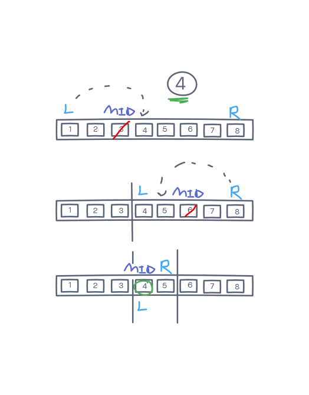

# Array Binary Search

Implements a function that when given an array argument and a search value to look for, returns the index of where the search key is located within the array or -1 if it's not found.

## Inputs / Outputs

Input -> [4, 8, 15, 16, 23, 42] | [-131, -82, 0, 27, 42, 68, 179] | [11, 22, 33, 44, 55, 66, 77] | [1, 2, 3, 5, 6, 7]

Output -> 2 | 4 | -1 | -1

## Algorithm

create a left index = 0 and a right index that points to the end of the array initially

loop through the array while the left and right index pointers are not equal

calculate the middle index of the array in regards to the values of the left and right pointers

if the value in the array at the mid index is the search key, match found: return the mid index

if the mid value is greater than the search key, adjust the left and right to the lower half of array, else the right

if there isn't a match after the loop finishes, return -1

### Big O

Space: O(1)
Time: O(log(N))

### Edge Cases

array of size 0, 1

Need to consider an array of odd size vs an array of even size

## Psuedo

const arrayBinarySearch = (arr, key) => {

left = 0, right = arr.length - 1

while(left <= right)

let mid = calculateMid()

if(arr[mid] === key) return mid

else if (arr[mid] < key) left = mid + 1;

else right = mid - 1;

end loop

return -1

## Code

```
const arrayBinarySearch = (arr, key) => {
  let left = 0;
  let right = arr.length - 1;

  while(left <= right) {
    let mid = Math.floor((right + left) / 2);
    if(arr[mid] === key) {
      return mid;
    } else if(arr[mid] < key) {
      left = mid + 1;
    } else {
      right = mid - 1;
    }
  }
  //result not found
  return -1;
};
```

## Visual

