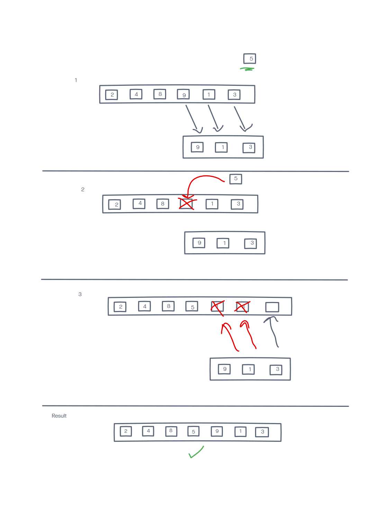

# Array Insert Shift

Implements a function that when given an array argument and a value to be added, returns a new array with the value to be added inserted in the middle.

## Inputs / Outputs

Input -> [2,4,6,-8], 5 | [42,8,15,23,42], 16

Output -> [2,4,5,6,-8] | [42,8,15,16,23,42]

## Algorithm

calculate the middle index and assign result to a variable

make an empty array and in a loop copy of the 2nd half of the original array to it

insert the argument to be added at the middle index

starting at the middle index + 1, reassign elements in original array with the copy array's values

### Big O

Space: O(N)
Time: O(N)

### Edge Cases

array of size 0, 1, or any odd numbered size

For an array of size one need to consider where element should be added, choosing to add on right side of array

Array of odd length: need to consider where element should be added, choosing to add on right side of array

For an empty array, simply add element

## Psuedo

function arrayInsertShift(arr, val)

newArr = []

let mid = Math.ceil(arr.length / 2)

for (for loop starting at mid until end)

newArr.push(arr[i]);

end loop

arr[mid] = val

loop starting at mid + 1 that goes while temp arr has values

arr[mid + idx] = newArr[idx]

end loop

return arr

## Code

```
function arrayInsertShift(arr, val) {
  let tempArr = [];

  if(arr.length === 0) return [val];

  let mid = Math.ceil(arr.length / 2);

  for(let i = 0; i < mid; i++) {
    if(arr[mid + i]) tempArr.push(arr[mid + i]);
  }
  arr[mid] = val;


  for(let j = 0, i = mid + 1; j < tempArr.length; i++, j++) {
    if(tempArr[j]) arr[i] = tempArr[j];
  }

  return arr;
}
```

## Visual


