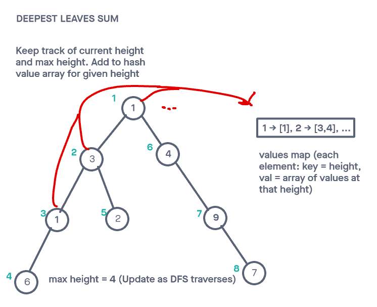

# Deepest Leaves Sum

## Challenge

Given a binary tree, return the sum of values of its deepest leaves (problem found [here](https://leetcode.com/problems/deepest-leaves-sum/)).

Constraints

- The number of nodes in the tree is in the range [1, 104].
- 1 <= Node.val <= 100

Tests will be written to prove the following functionality:

    Can successfully get the sum of values of the deepest leaves while not including values from other levels.
    Can successfully get the sum of values for an incomplete tree (non-leaf nodes exist with less than 2 children)
    Can successfully handle a tree with a single node
    Can successfully handle an empty tree

## Approach & Efficiency

<!-- What approach did you take? Why? What is the Big O space/time for this approach? -->

For this one, my approach was to recursively traverse through the tree a single time while performing a DFT.

During this single pass, the height of the node and the max height were tracked. As the DFT executed, a hashmap that stored the values of each node was built upon. Each key in the map represented a given height. The corresponding value was an array of values for that height.

The hash map value equal to the max height was iterated through and the sum of its values returned.

I followed my created visual in order to more easily turn my idea into code.

The time and space complexity were both O(n).

---

## API

<!-- Description of each method publicly available to your Linked List -->

deepestLeavesSum(root):

- Arguments: root node of binary tree
- Returns: a number
- This method iterates through a binary tree and the sum of the leave's values on the bottom level of the tree.

---

### Whiteboard Visual

### Link To Code

Implementation can be found [here](./deepestLeavesSum.js)

Tests can be found [here](./deepestLeavesSum.test.js)
