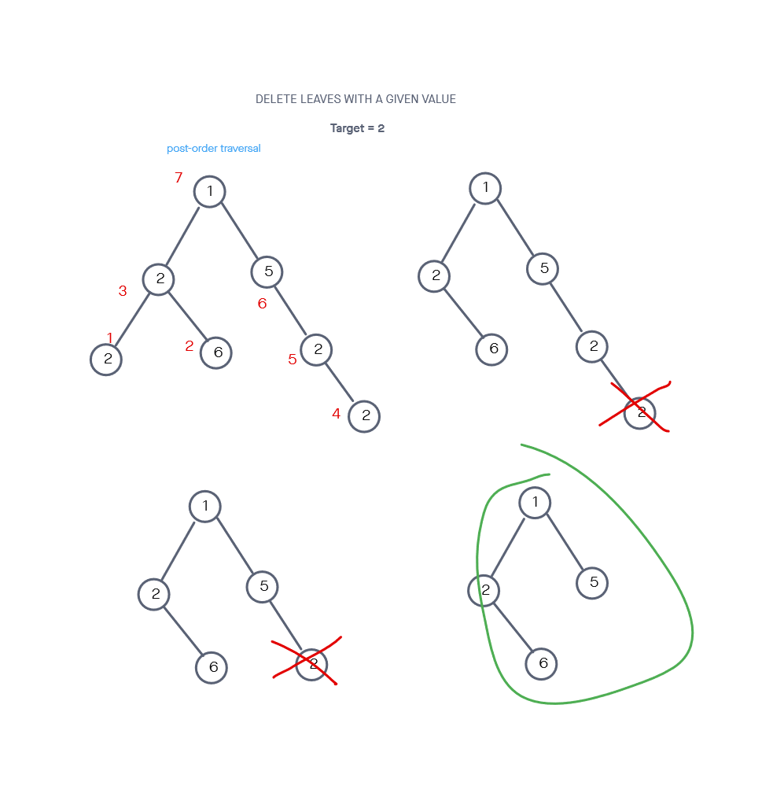

# Delete Leaves With a Given Value

## Challenge

Given a binary tree root and an integer target, delete all the leaf nodes with value target.

Note that once you delete a leaf node with value target, if its parent node becomes a leaf node and has the value target, it should also be deleted. You need to continue doing that until you cannot (problem found [here](https://leetcode.com/problems/delete-leaves-with-a-given-value/)).

Constraints

- The number of nodes in the tree is in the range [1, 3000].
- 1 <= Node.val, target <= 1000

Tests will be written to prove the following functionality:

    Can successfully delete all the leaves with target value
    Can successfully delete all the leaves with target value when Will not delete nodes with the target value that are not leaves
    Can successfully handle a tree that contains only the target value

## Approach & Efficiency

<!-- What approach did you take? Why? What is the Big O space/time for this approach? -->

For this one, my approach was to recursively perform a post-order traversal. As frames were popped off the call stack, the left and right properties of previous nodes were assigned. A check was performed to know if a leaf node should be reassigned to null as this happened. Faster than 100.00% of submissions on site that posted problem.

I followed my created visuals for in order to more easily turn ideas into code.

The time complexity was O(n) and the space complexity was O(n) given that a frame on the call stack was created for every node.

---

## API

<!-- Description of each method publicly available to your Linked List -->

deleteTreeLeavesWithValue(root, target):

- Arguments: the first node in binary tree, the value to delete
- Returns: the root node of the binary tree
- This method traverses all nodes in a binary tree and deletes all leaf nodes that have a target value (and also to-be leaf nodes with target value after other leaf deletions).

---

### Whiteboard Visual

### Link To Code

Implementation can be found [here](./deleteTreeLeavesWithValue.js)

Tests can be found [here](./deleteTreeLeavesWithValue.test.js)
