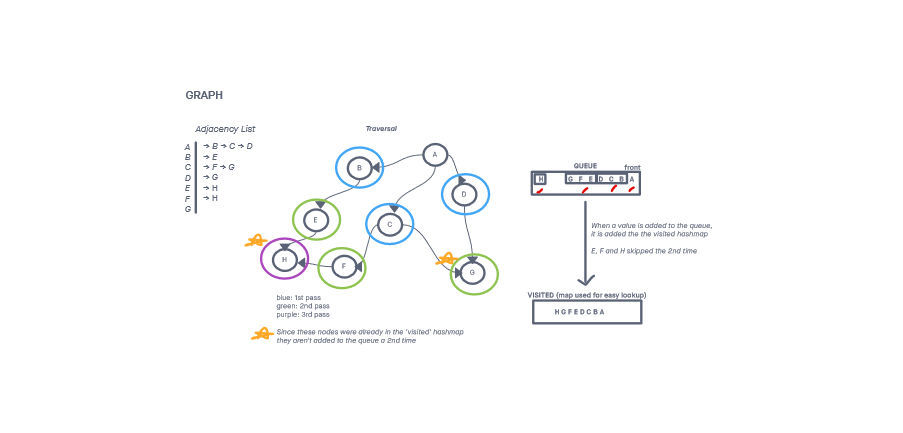

# Graph Breadth First Search

## Challenge

Implement a breadth first traversal method on a graph class.

Write tests to prove the following functionality:

    The traversal can properly perform a breadth first traversal
    The traversal can start from different nodes on the graph and properly traverse
    The traversal can handle an empty graph
    The traversal can handle a cyclic graph
    The traversal can handle a graph that has nodes with a degree higher than 1 (2+ neighbors)

## Approach & Efficiency
<!-- What approach did you take? Why? What is the Big O space/time for this approach? -->
I took an iterative approach for the breath traversal of the graph. A queue was needed for this approach. I also used a set to keep track of nodes that have been traversed before so that they wouldn't be added to the queue a 2nd time.

I followed my created visual in order to more easily turn my idea into code.

 
I wasn't to sure on the time complexity of the breadth first traversal I used at first.

According to the article [here](https://www.techiedelight.com/breadth-first-search/) which used a similar traversal, the complexity is O(V + E) where V and E are the total number of vertices and edges in the graph.

The space complexity for the traversal was O(N).

  

-----

## API
<!-- Description of each method publicly available to your Linked List -->

Graph

* breadthFirstTraversal(node):
  * Argument: node
  * Returns: an array containing the nodes that were traversed (prompt does not explicitly specify what 'shape' the return data should have)
  * Traverses over the tree in a breadth-first manner starting from the supplied node

-----

### Whiteboard Visual

### Link To Code

Code can be found [here](./graph.js)

Test can be found [here](./graph-bft.test.js)
