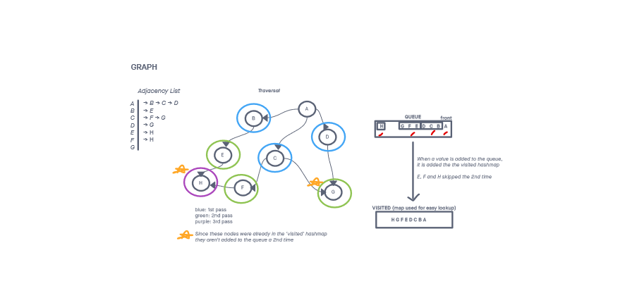

# Graph Implementation Challenge

## Challenge

Implement a graph by creating a class with the methods described below. This graph should be implemented as an adjacency list.

Write tests to prove the following functionality:

    Node can be successfully added to the graph
    An edge can be successfully added to the graph
    A collection of all nodes can be properly retrieved from the graph
    All appropriate neighbors can be retrieved from the graph
    Neighbors are returned with the weight between nodes included
    The proper size is returned, representing the number of nodes in the graph
    A graph with only one node and edge can be properly returned
    An empty graph properly returns null

## Approach & Efficiency
<!-- What approach did you take? Why? What is the Big O space/time for this approach? -->
I took an iterative, breath first approach for my traversal of the graph.
I implemented the graph as an adjacency list by using a hashmap where the key was the node, and the value was an array of neighbors which were edges.
Every time a node was created it was given an entry to store its neighbors (as an edge object) which was initially empty.
Creating edges would add the endNode to the neighbors array of the start node that was inside of the adjacency list hashmap.

 
I wasn't to sure on the time complexity of the breadth first traversal I used.

According to the article [here](https://www.techiedelight.com/breadth-first-search/) which used a similar traversal, the complexity is O(V + E) where V and E are the total number of vertices and edges in the graph.

The space complexity for the traversal was O(N).

Aside from the getNodes method which had a time complexity of O(N), the time complexity of all other methods was O(1).
  

-----

## API
<!-- Description of each method publicly available to your Linked List -->

Graph

* addNode(value)
  * Arguments: value
  * Returns: the added node
  * adds a node to the graph (no edges/not connected to other nodes)
  
* addEdge(node1, node2 [,weight])
  * Arguments: node1, node2, [optional: weight]
  * Returns: nothing
  * Creates an edge between the 2 passed in nodes that optionally can have a weight
  (both nodes must already be in the graph)
  
* getNodes()
  * Arguments: none
  * Returns: an array of all the nodes in the list
  * Traverses over the graph and adds all nodes to an array
  
* getNeighbors(node):
  * Arguments: a node
  * Returns: an array containing the edges connected to the given node
  * Searches the graph for the edges that are connected to the given node. The edges contain info on the neighbors of said node.
  
* size():
  * Argument: none
  * Returns: a number representing the size of graph
  * Calculates the number of nodes in the tree

-----

### Whiteboard Visual

### Link To Code

Code can be found [here](./graph.js)

Test can be found [here](./graph.test.js)
