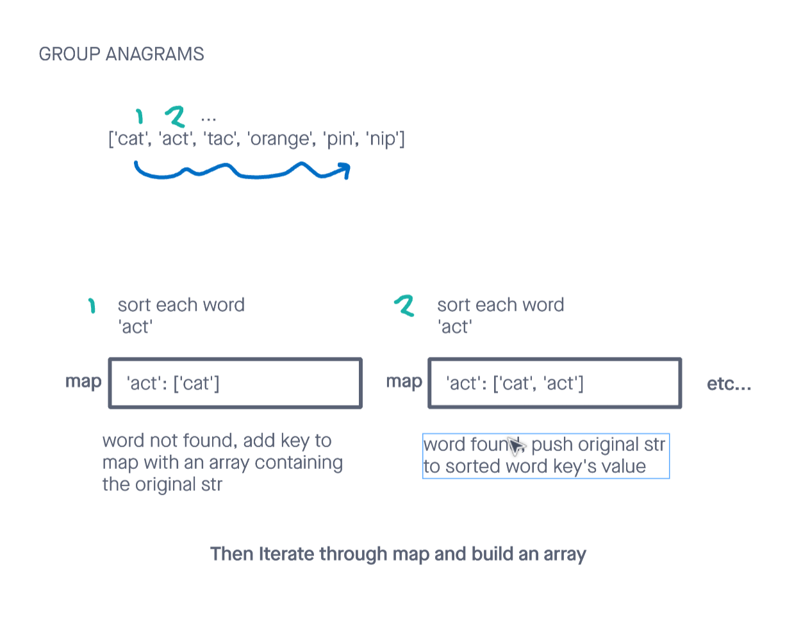

# Group Anagrams

## Challenge

Given an array of strings, group the anagrams together as an array of arrays. You can return the answer in any order (problem found [here](https://leetcode.com/problems/group-anagrams/)).

Constraints

- 1 <= strs.length <= 104
- 0 <= strs[i].length <= 100
- strs[i] consists of lowercase English letters.

Tests will be written to prove the following functionality:

    Can successfully group anagrams given an array of strings and return them.
    Can successfully handle an empty array as input
    Can successfully handle an input array containing words that are already sorted (e.g. abc, act...)
    Can successfully handle duplicates (including duplicates in result)

## Approach & Efficiency

<!-- What approach did you take? Why? What is the Big O space/time for this approach? -->

Using a hashmap to handle grouping anagrams seemed like the best approach.

During a single pass, each word before being added to a hashmap that contained the sorted word as a key, and an array of anagrams to it as a value. After this, an array was built from the resultant hashmap and returned.

I followed my created visual in order to more easily turn my idea into code.

The space complexity was O(n). Given that the built in js sort method uses tim sort, the time complexity is O(n \* (m log(m)) where n is the length of the input array and m is the roughly the average amount of characters per string within that array.

---

## API

<!-- Description of each method publicly available to your Linked List -->

deepestLeavesSum(words):

- Arguments: and array of strings
- Returns: an array of arrays
- This method iterates through an array of words and returns an array where each index is an array of grouped anagrams.

---

### Whiteboard Visual

### Link To Code

Implementation can be found [here](./groupAnagrams.js)

Tests can be found [here](./groupAnagrams.test.js)
