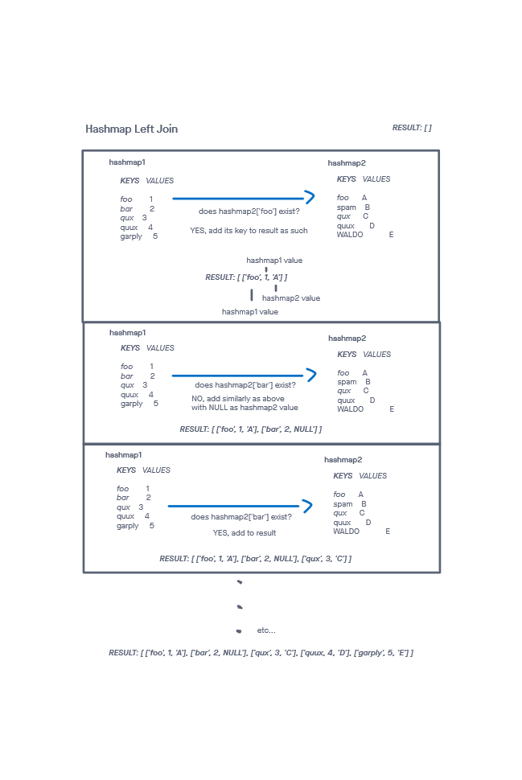

# Hashmap Left Join

## Challenge

Implement a simplified LEFT JOIN for 2 Hashmaps. The hashmaps are mimicking a traditional table in SQL

Write tests to prove the following functionality:

    Can successfully left join 2 hashmaps and return the result as an array of arrays
    Can successfully left join 2 hashmaps where there are no like values in right hashmap
    Can handle 1 or 2 empty hashmaps
    Can successfully left join 2 hashmaps where the 2nd hashmap's values all exist in the first hashmap

## Approach & Efficiency
<!-- What approach did you take? Why? What is the Big O space/time for this approach? -->

For this one, all I had to do was iterate over the first hashmap and check if each values was present in the 2nd hashmap. If so, I would join the corresponding right value with the 'left' hashmap's key and value in a result array.

I followed my created visual in order to more easily turn my idea into code.

The time complexity was O(n). I had to iterate through the first hashmap a single time.

The space complexity was O(n) as well. I had a single array created of size n.

-----

## API
<!-- Description of each method publicly available to your Linked List -->
hashmapLeftJoin(map1, map2):

* Arguments: 2 hashmaps
* Returns: an array with an array at each index containing the first table key, its corresponding value, and the corresponding value in the 2nd hashmap (or NULL if none).
* This method iterates through 2 binary search trees and returns a set of values that are found in both

-----

### Whiteboard Visual

### Link To Code

Implementation can be found [here](./hashmapLeftJoin.js)

Tests can be found [here](./hashmapLeftJoin.test.js)
