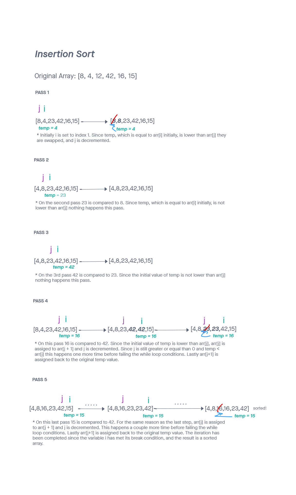

# Challenge Summary
<!-- Description of the challenge -->
Review the pseudocode provided, then trace the algorithm by stepping through the process with the provided sample array. Document your explanation by creating a blog article that shows the step-by-step output after each iteration through some sort of visual.

Once you are done with your article, code a working, tested implementation of Insertion Sort based on the pseudocode provided.

## Whiteboard Process

## Approach & Efficiency

Approach & Efficiency can be found [here](./BLOG.md)

## Solution

Solution can be found [here](./BLOG.md)
