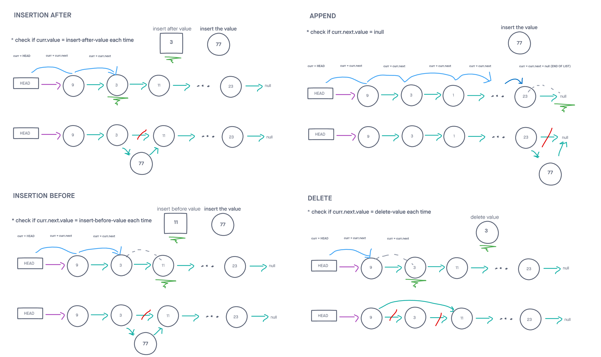

# Singly Linked List v2

## Adds node deletion and various types of node insertion

This class creates a singly linked list, an abstract data type that can dynamically adds nodes without requiring chunk of memory to be contiguously allocated beforehand.

## Challenge

Create a class that implements a linked list and contains the following methods:

append

delete

insertBefore

insertAfter

You have access to the Node class and all the properties on the Linked List class.

Write tests to prove the following functionality:

    Can successfully add a node to the end of the linked list
    Can successfully add multiple nodes to the end of a linked list
    Can successfully insert a node before a node located i the middle of a linked list
    Can successfully insert a node before the first node of a linked list
    Can successfully insert after a node in the middle of the linked list
    Can successfully insert a node after the last node of the linked list

## Approach & Efficiency
<!-- What approach did you take? Why? What is the Big O space/time for this approach? -->
My approach was rather straightforward for this problem. I started with a basic linked list class from a previous challenge as allowed. I took on one bullet point at a time from the list above. Afterward completing each requirement, I checked for accuracy with unit tests for each (no tests here for the existing linked list methods).

I followed my created visuals for in order to more easily turn ideas into code.

The delete, insertAfter, and insertBefore methods took O(N) time

Appending to the collection took O(1) time. This was more efficient due to an added tail pointer. This pointer prevented another traversal through the list.

## API
<!-- Description of each method publicly available to your Linked List -->
LinkedList: takes in a value as an argument

insertAfter(val, newVal):
    Arguments: a value that should exist in the list and a value to add
    Returns: nothing
    This method adds a new node with that value immediately after the node with the first arguments value

insertBefore(val, newVal):
    Arguments: a value that should exist in the list and a value to add
    Returns: nothing
    This method adds a new node with that value immediately before the node with the first arguments value

delete(val):
    Arguments: a value to delete
    Returns: nothing
    This method searches for the first node with the specified value, and then deletes it from the list

append(val):
    Arguments: a value to append
    Returns: nothing
    This method adds a new node with that value to the end of the list.

insert(val):
    Arguments: a value
    Returns: nothing
    This method adds a new node with that value to the head of the list.

includes(val):
    Arguments: a value
    Returns: a boolean
    This method checks to see if the argument is contained within the linked list

toString():
    Arguments: none
    Returns: a formatted string in the shape of,
    "{ val1 } -> { val2 } -> ... -> { valN } -> NULL"

### Whiteboard Visual

### Link To Code

Code can be found 
