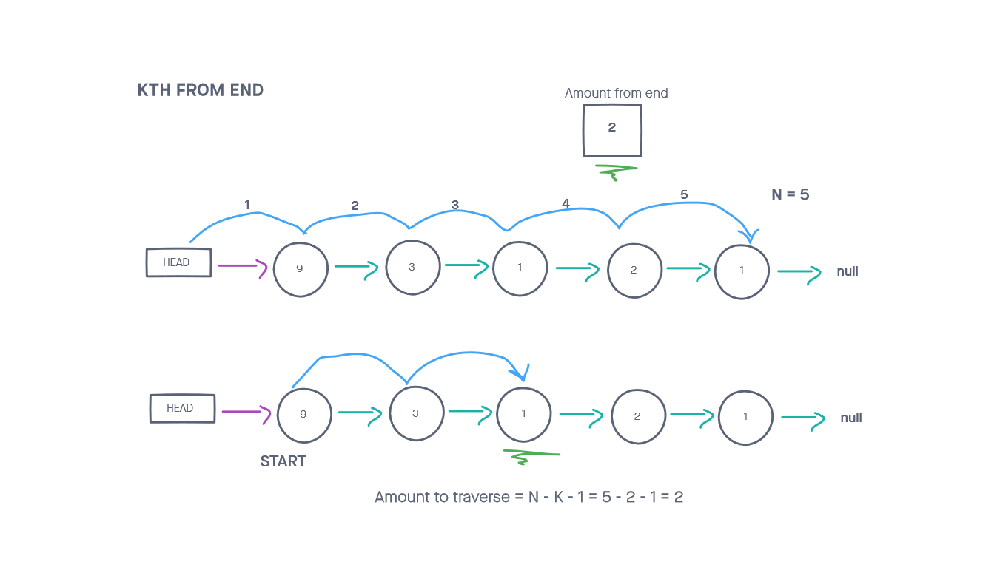

# Singly Linked List v3

## Adds kth from end node searching

This class creates a singly linked list, an abstract data type that can dynamically adds nodes without requiring chunk of memory to be contiguously allocated beforehand.

## Challenge

Create a class that implements a linked list and contains the following methods:

kthFromEnd

You have access to the Node class and all the existing properties + methods on the Linked List class.

Write tests to prove the method can handle the following inputs:

    Where k is greater than the length of the linked list
    Where k and the length of the list are the same
    Where k is not a positive integer
    Where the linked list is of a size 1
    “Happy Path” where k is not at the end, but somewhere in the middle of the linked list

## Approach & Efficiency
<!-- What approach did you take? Why? What is the Big O space/time for this approach? -->
My approach was rather straightforward for this problem. I started with a basic linked list class from a previous challenge as allowed. I took on one bullet point at a time from the list above. Afterward completing each requirement, I checked for accuracy with unit tests for each (no tests here for the existing linked list methods). There were a lot of edge cases for this one, so this was especially important.

I followed my created visuals for in order to more easily turn ideas into code.

This algorithm  took O(N) time, since a maximum of two iterations through the entire list were required.

The algorithm O(1) space. A value was needed for iteration and another was needed for keeping track of the list's length.

## API
<!-- Description of each method publicly available to your Linked List -->
LinkedList: takes in a value as an argument

kthFromEnd(k)
    Arguments: a number k
    Returns: the node’s value that is k places from the end of the linked list
    This method looks through the list and returns the value k from the end, if possible. The appropriate error will be thrown if this is not possible.

insertAfter(val, newVal):
    Arguments: a value that should exist in the list and a value to add
    Returns: nothing
    This method adds a new node with that value immediately after the node with the first arguments value

insertBefore(val, newVal):
    Arguments: a value that should exist in the list and a value to add
    Returns: nothing
    This method adds a new node with that value immediately before the node with the first arguments value

delete(val):
    Arguments: a value to delete
    Returns: nothing
    This method searches for the first node with the specified value, and then deletes it from the list

append(val):
    Arguments: a value to append
    Returns: nothing
    This method adds a new node with that value to the end of the list.

insert(val):
    Arguments: a value
    Returns: nothing
    This method adds a new node with that value to the head of the list.

includes(val):
    Arguments: a value
    Returns: a boolean
    This method checks to see if the argument is contained within the linked list

toString():
    Arguments: none
    Returns: a formatted string in the shape of,
    "{ val1 } -> { val2 } -> ... -> { valN } -> NULL"

### Whiteboard Visual

### Link To Code

Code can be found 
