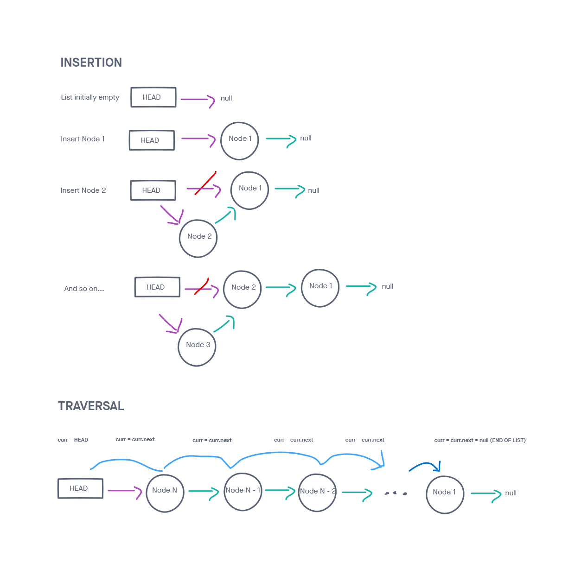

# Singly Linked List

This class creates a singly linked list, an abstract data type that can dynamically adds nodes without requiring chunk of memory to be contiguously allocated beforehand.

## Challenge

Create a class that implements a linked list and contains the following methods:

insert

toString

includes

This class should be able to do all of the following:

* Can successfully instantiate an empty linked list
* Can properly insert into the linked list
* The head property will properly point to the first node in the linked list
* Can properly insert multiple nodes into the linked list
* Will return true when finding a value within the linked list that exists
* Will return false when searching for a value in the linked list that does not exist
* Can properly return a collection of all the values that exist in the linked list

## Approach & Efficiency
<!-- What approach did you take? Why? What is the Big O space/time for this approach? -->
My approach was rather straightforward for this problem. After creating the class, I took on one bullet point at a time from the list above. Afterward completing each requirement, I checked for accuracy with a self-written test.

I followed conventional diagrams for inserting and iterating over the list.

Traversal over the collection (including search/includes) took O(N) time

Insertion into the collection took O(1) time

## API
<!-- Description of each method publicly available to your Linked List -->
LinkedList: takes in a value as an argument

insert(val):
    Arguments: a value
    Returns: nothing
    This method adds a new node with that value to the head of the list.

includes(val):
    Arguments: a value
    Returns: a boolean
    This method checks to see if the argument is contained within the linked list

toString():
    Arguments: none
    Returns: a formatted string in the shape of,
    "{ val1 } -> { val2 } -> ... -> { valN } -> NULL"

### Diagram

