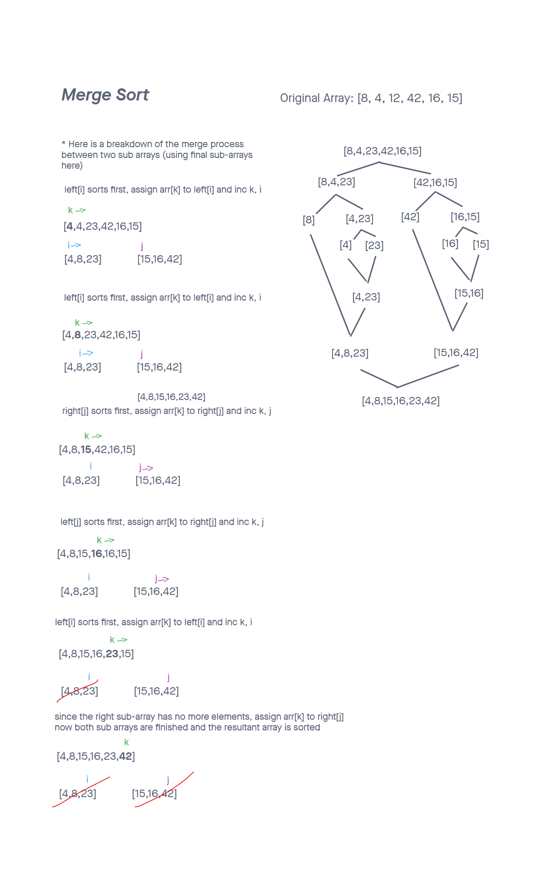

# Merge Sort

Merge sort is a highly efficient divide an conquer sorting algorithm that continuously splits the passed in array in two. This is done until the sub arrays have a single element. The sub arrays are then built back together using comparisons resulting in larger and larger sorted sub arrays until a single sorted array is built.

## Psuedocode

```
ALGORITHM Mergesort(arr)
    DECLARE n <-- arr.length

    if n > 1
      DECLARE mid <-- n/2
      DECLARE left <-- arr[0...mid]
      DECLARE right <-- arr[mid...n]
      // sort the left side
      Mergesort(left)
      // sort the right side
      Mergesort(right)
      // merge the sorted left and right sides together
      Merge(left, right, arr)

ALGORITHM Merge(left, right, arr)
    DECLARE i <-- 0
    DECLARE j <-- 0
    DECLARE k <-- 0

    while i < left.length && j < right.length
        if left[i] <= right[j]
            arr[k] <-- left[i]
            i <-- i + 1
        else
            arr[k] <-- right[j]
            j <-- j + 1

        k <-- k + 1

    if i = left.length
       set remaining entries in arr to remaining values in right
    else
       set remaining entries in arr to remaining values in left
```

--------------

Code of this implementation can be found [here](./mergeSort.js)

Tests verifying this approach can be found [here](./mergeSort.test.js)

--------------

## Trace



* Through recursive calls, the array is continuously divided into sub arrays until they reach a size of 1.

* Then the left and right sub-arrays are compared using i and j pointers that reference the current position in their sub-arrays. For all the values in the sub-arrays, i is incremented if it the current left array value sorts first and j if it's the right. The original sub-array (passed in from the level above) is 'rebuilt' one at a time by using a k pointer and is assigned the value that sorts first from either the left or right sub-array.

### Complexity

  Time: O(n*log(n))

  In any scenario, the time complexity of this algorithm is O(n*log(n))

  Space: O(n)

  Sorting is not done in place and extra space is needed for the sub-arrays.
