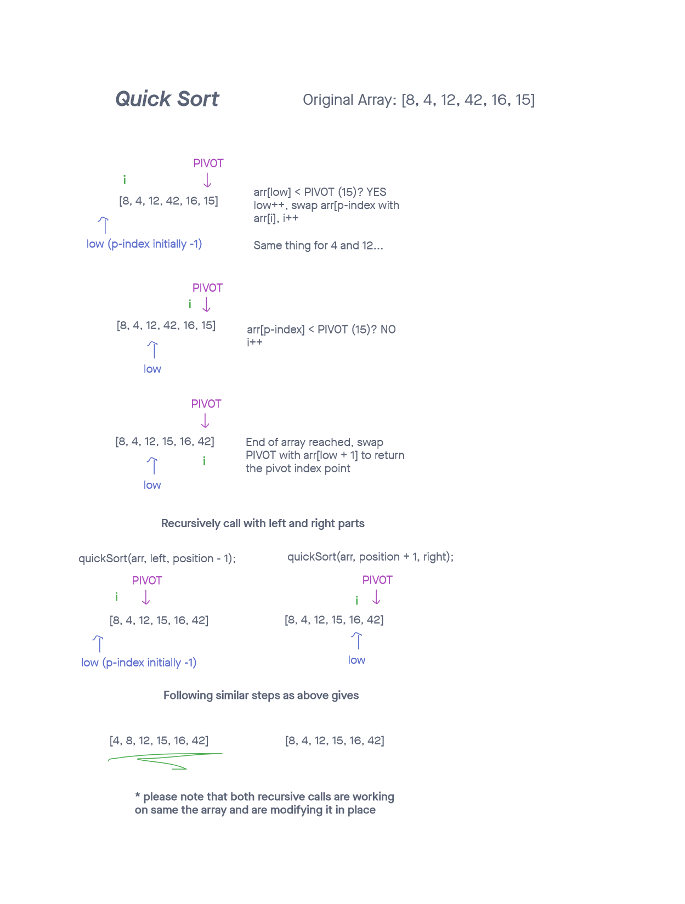

# Quick Sort

Quick sort is a highly efficient and widely used divide and conquer sorting algorithm. This sort chooses a pivot element and partitions the array  off that partition element. I.e. it places all smaller elements on the left of the pivot element, and all larger elements on the right side of the pivot element. This sequence of steps runs again on both the left and the right sides of the original pivot element recursively. Once all positions have run through this, the array will be sorted.

## Psuedocode

```
ALGORITHM QuickSort(arr, left, right)
    if left < right
        // Partition the array by setting the position of the pivot value
        DEFINE position <-- Partition(arr, left, right)
        // Sort the left
        QuickSort(arr, left, position - 1)
        // Sort the right
        QuickSort(arr, position + 1, right)

ALGORITHM Partition(arr, left, right)
    // set a pivot value as a point of reference
    DEFINE pivot <-- arr[right]
    // create a variable to track the largest index of numbers lower than the defined pivot
    DEFINE low <-- left - 1
    for i <- left to right do
        if arr[i] <= pivot
            low++
            Swap(arr, i, low)

     // place the value of the pivot location in the middle.
     // all numbers smaller than the pivot are on the left, larger on the right.
     Swap(arr, right, low + 1)
    // return the pivot index point
     return low + 1

ALGORITHM Swap(arr, i, low)
    DEFINE temp;
    temp <-- arr[i]
    arr[i] <-- arr[low]
    arr[low] <-- temp
```

--------------

Code of this implementation can be found [here](./quickSort.js)

Tests verifying this approach can be found [here](./quickSort.test.js)

--------------

## Trace



* Each time the function is called, a pivot element is chosen.
* All elements less than pivot placed on left side of the pivot element and all larger are placed on right.
* Recursively do this again for both the left and the right side.

### Complexity

  Time: O(n*log(n))

  On average, the time complexity of this algorithm is O(n*log(n)). In the worst case scenario this complexity rises to O(n^2).

  Space: O(1)

  Sorting is done in place and only a few extra variables are needed.
