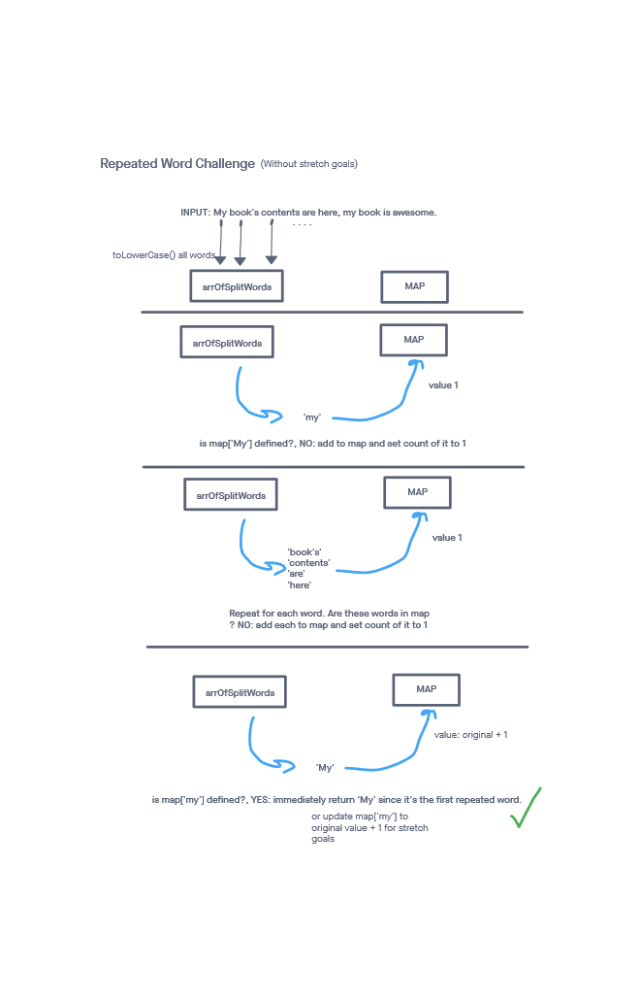

# Hashmap Repeated Word

## Challenge

Find the first repeated word in a book. As a stretch goal, also calculate how many times each word appears and find the most frequently used words. Return a string with this information.

Write tests to prove the following functionality:

    Can successfully find the first word to occur more than once in a string as part of the resultant string
    Can return a count of each of the words in the provided string and return said info as part of the resultant string (stretch goal)
    Can return a list of the words most frequently used in the provided string and return said info as part of the resultant string (stretch goal)

## Approach & Efficiency
<!-- What approach did you take? Why? What is the Big O space/time for this approach? -->
The challenge title mentioned a Hashmap, however it wasn't explicitly stated. I decided to use a vanilla js object since it is very similar to a hashmap in behavior. After splitting the book string into individual words, I added them to a map that kept track of their counts. For each task, I broke the related logic into its own function to keep my code highly modular.

I followed my created visual in order to more easily turn my idea into code.

The time complexity was O(n). I had to iterate through the created map or the words array quite a few times to complete all the features of the function, but there was no nested iterating.

The space complexity was O(n) as well. A map of size n or less, a words array of size n, and a few additional variables were needed.

-----

## API
<!-- Description of each method publicly available to your Linked List -->
  repeatedWord(val):

  Arguments: a string that represents the books contents
  Returns: a string containing the results
  This method parses a book string and calculates the values mentioned in the challenge description

-----

### Whiteboard Visual

### Link To Code

Implementation can be found [here](./repeatedWord.js)

Tests can be found [here](./repeatedWord.test.js)
