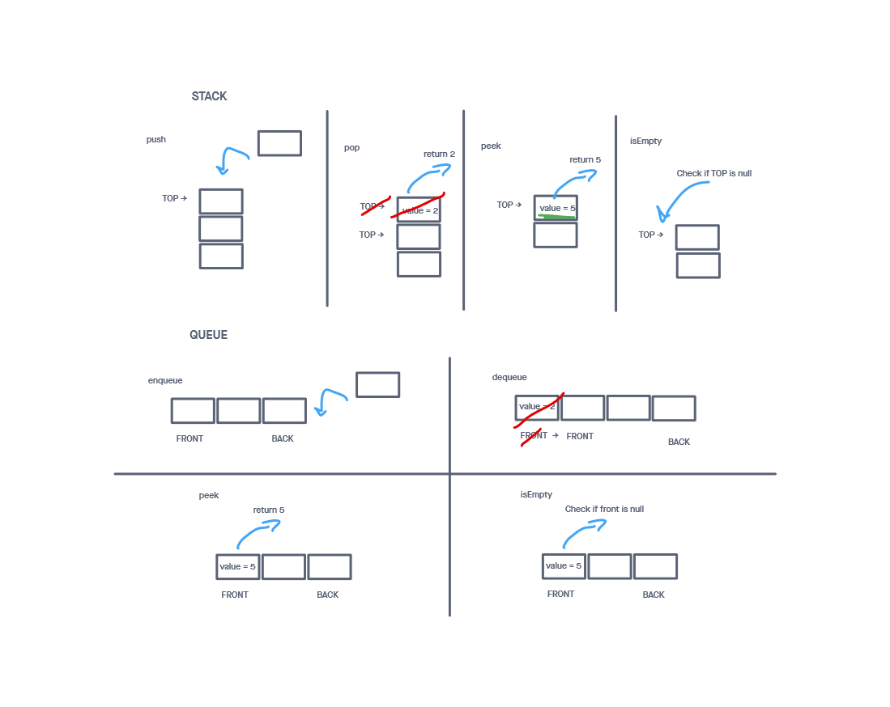

# Stack and Queue

## Implements a Stack and Queue class

The 2 classes defined here create a stack and a queue that are built with a singly linked list.

## Challenge

Create a stack and a queue class that implements a singly linked list and contains the following methods:

Stack:

push, pop, peek, isEmpty

Queue:

enqueue, dequeue, peek, isEmpty

Write tests to prove the following functionality:

    Can successfully push onto a stack
    Can successfully push multiple values onto a stack
    Can successfully pop off the stack
    Can successfully empty a stack after multiple pops
    Can successfully peek the next item on the stack
    Can successfully instantiate an empty stack
    Calling pop or peek on empty stack raises exception
    Can successfully enqueue into a queue
    Can successfully enqueue multiple values into a queue
    Can successfully dequeue out of a queue the expected value
    Can successfully peek into a queue, seeing the expected value
    Can successfully empty a queue after multiple dequeues
    Can successfully instantiate an empty queue
    Calling dequeue or peek on empty queue raises exception

## Approach & Efficiency
<!-- What approach did you take? Why? What is the Big O space/time for this approach? -->
The main things to consider when building each method were how should the next pointers for each node be manipulated as well when should the top/start/end pointers be updated. With those things in mind I took on one bullet point at a time from the list above. Afterward completing each requirement, I checked for accuracy with unit tests for each (no tests here for the existing linked list methods).

I followed my created visuals in order to more easily turn ideas into code.

The push, pop, enqueue, dequeue, peek, and isEmpty methods all took O(1) time.

-----

## API
<!-- Description of each method publicly available to your Linked List -->
Stack: takes no arguments when instantiated

  push(val):

  Arguments: a value to add to the stack
  Returns: nothing
  This method creates a node from the supplied value and adds it to the top of the stack

  pop():

  Arguments: none
  Returns: the value from the node that was removed from the stack
  This method removes the node from the top of the stack or throws an exception if there are no nodes to remove

  peek():

  Arguments: none
  Returns: the value from the node that was on top of the stack
  This method checks the top node on the stack and grabs its value or throws an exception if there are no nodes

  isEmpty():

  Arguments: none
  Returns: a boolean
  This method checks to see if there are any nodes in the stack

Queue: takes no arguments when instantiated

  enqueue(val):

  Arguments: a value to add to the queue
  Returns: nothing
  This method creates a node from the supplied value and adds it to the back of the queue

  dequeue():

  Arguments: none
  Returns: the value from the node that was removed from the queue
  This method removes the node from the front of the queue or throws an exception if there are no nodes to remove

  peek():

  Arguments: none
  Returns: the value from the node that was on at the front of the queue
  This method checks the first node on the stack and grabs its value or throws an exception if there are no nodes

  isEmpty():

  Arguments: none
  Returns: a boolean
  This method checks to see if there are any nodes in the queue

-----

### Whiteboard Visual

### Link To Code

Code can be found  and [here (queue)](./queue)
