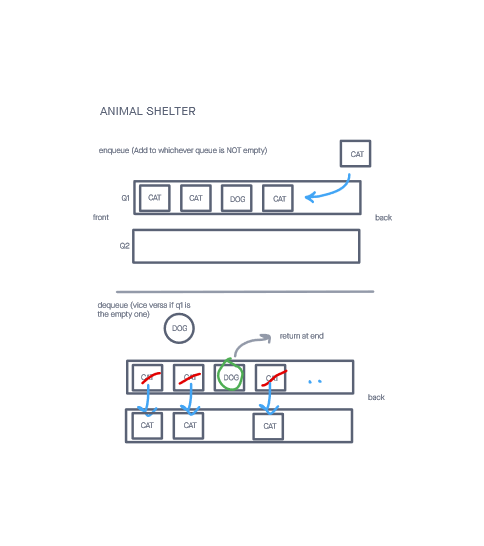

# Animal Shelter

## Implements an Animal Shelter Class

This class stores objects that denote a cat or a dog and maintains a FIFO order

## Challenge

Create a class called AnimalShelter which holds only dogs and cats.
The shelter operates using a first-in, first-out approach.
Implement the following methods:

enqueue, dequeue

Tests were written to prove the following functionality:

    Shelter allows the dequeuing of one animal type mixed in with others without changing the FIFO order
    Shelter allows the enqueuing and dequeuing of either a dog or cat
    The dequeue method returns null if the user enters an animal that is not a cat or dog when dequeueing
    Shelter does not allow the dequeuing of animals if there are no animals in it
    Dequeue method returns null if a valid animal type if preferred, but no animals of that type are in the shelter

## Approach & Efficiency
<!-- What approach did you take? Why? What is the Big O space/time for this approach? -->
My approach was to find what combination of stacks and queues would work best in terms of efficiency. I ended up implementing this solution with 2 queues. The challenge here was maintaining the FIFO order when the first item wasn't the correct animal. I ended up moving all the data to a 2nd queue when this happened to maintain order integrity which was still relatively efficient.

It was assumed that the object passed into enqueue had an animal property, and any number of other properties

I followed my created visuals in order to more easily turn ideas into code.

The enqueue method took O(1) time and the dequeue method took either O(1) time if the animal at the front of the queue was the correct time, or O(N) time if it was not.

-----

## API
<!-- Description of each method publicly available to your Linked List -->

enqueue(animal):

  Arguments: a value to add to the queue
  Returns: nothing
  This method creates an entry of from the supplied object that represents a cat or a dog

dequeue(pref):

  Arguments: a string preference that is either a cat or dog
  Returns: the first animal in 'line' that matches that preference, if there are no animals of that preferences, or no animals, an error is thrown

-----

### Whiteboard Visual

### Link To Code

Code can be found 
