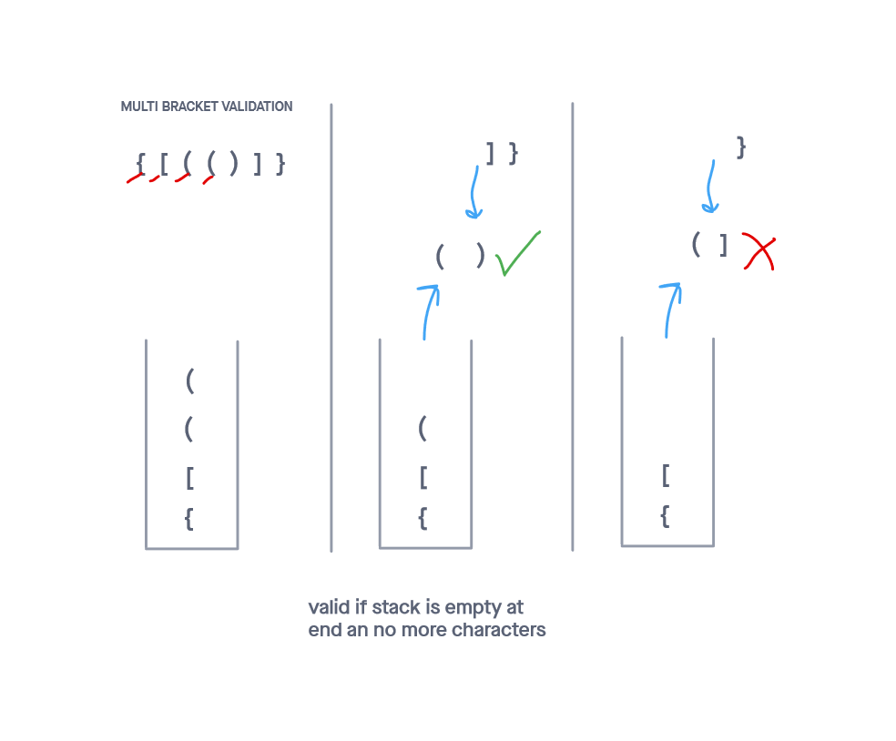

# Multi Bracket Validator

## Implements a class that validates brackets

## Challenge

Create a function called validateBrackets which takes a string and determines whether or not the brackets in the string are balanced

Tests were written to prove the following functionality:

    The method can handle square, curly, or round brackets
    The method can work with extra characters sprinkled into the mix
    The method can properly handle dangling left or right brackets

## Approach & Efficiency
<!-- What approach did you take? Why? What is the Big O space/time for this approach? -->
My approach was to find what structure could store data, and immediately return the most recent right bracket with a left one in one pass of the input. The Stack was clearly a good choice.

Coming up with an efficient way to do this was the challenge here. I ended up using an object to map the bracket halves while checking right brackets to the top of the stack.

I followed my created visuals in order to more easily turn ideas into code.

This solution took O(N) time and O(N) space

-----

## API
<!-- Description of each method publicly available to your Linked List -->

validateBrackets(str):

  Arguments: a string to parse
  Returns: a boolean
  This method checks if all the left brace are properly matched with right ones

-----

### Whiteboard Visual

### Link To Code

Code can be found 
