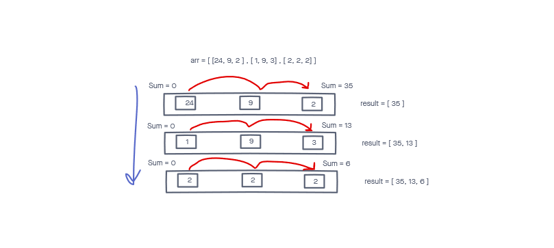

# Sum of Rows

sum up each row in a matrix and return an array of the sum

## Inputs / Outputs

Input <--- 2d array of integers

Output <--- array with the sum of each row in original matrix as value at each index

## Algorithm

loop through rows of array

for every entry in array (each row), loop through the entries of that array

get a sum of the values at each column in the row that is being dealt with and push that value to a result array

after loop finishes, return array

### Big O

Space: O(N)
Time: O(N^2)

### Edge Cases

None

## Psuedo

result = []

for let row of array

sum = 0

for entry of row -> sum += value of col

end inner loop

push(sum)

end outer loop

return result

## Code

```
const getSumOfRows(arr) => {
  let result = [];

  for(let row of rows) {
    let sum = 0;
    for(let col of cols) {
      sum += col;
    }
    result.push(sum);
  }

  return result;
}
```

## Visual


