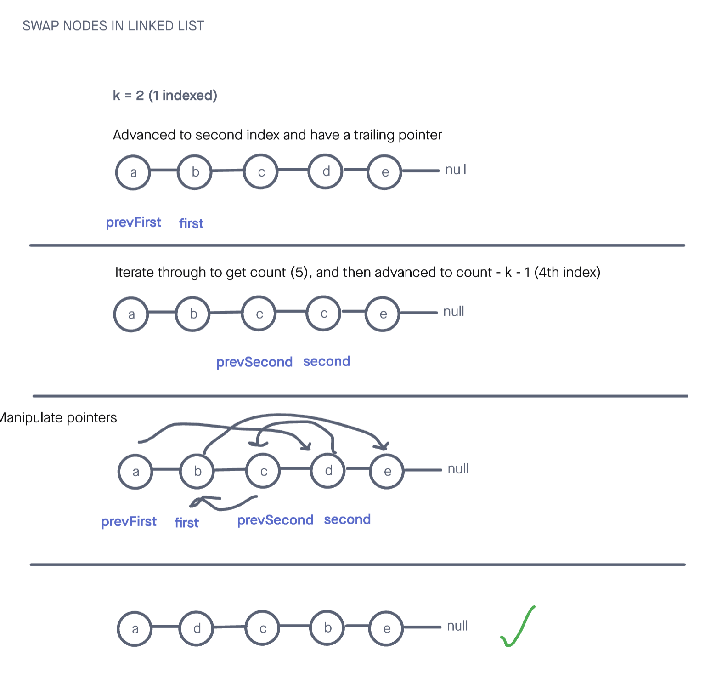

# Swap Nodes Linked List

## Challenge

You are given the head of a linked list, and an integer k.

Return the head of the linked list after swapping the values of the kth node from the beginning and the kth node from the end (the list is 1-indexed).(problem found [here](https://leetcode.com/problems/swapping-nodes-in-a-linked-list/)).

Constraints

- The number of nodes in the list is n.
- 1 <= k <= n <= 105
- 0 <= Node.val <= 100

Tests will be written to prove the following functionality:

    Can successfully swap 2 arbitrary nodes in a list.
    Can successfully handle a list where k nodes from the end and k nodes from the start is the same node
    Can successfully handle a value of k that is the size of the list
    Can successfully handle a list of size 1, k = 1

## Approach & Efficiency

<!-- What approach did you take? Why? What is the Big O space/time for this approach? -->

For this one, my approach was to iterate through the loop twice to locate the nodes k from the start and k from the end. Originally I then tried to manipulate the previous node for each and swap the entire nodes as the graphic shows. When I realized that this was a bad approach that proved to be troublesome with edge cases I abandoned this approach. By simply swapping the 2 node's values I could avoid all the pointer manipulation and solve the problem. Faster than 99.67% of submissions on site that posted problem.

I followed my visual at first, but ended up going with a different approach as mentioned.

The time complexity was O(n) and the space complexity was O(1).

---

## API

<!-- Description of each method publicly available to your Linked List -->

swapListNodes(head, k):

- Arguments: the first node in the list and an integer 'k'
- Returns: the head of the list
- This method locates the nodes k from the start and k from the end of a linked list, and then swap them before returning the head of the list

---

### Whiteboard Visual

### Link To Code

Implementation can be found [here](./swapNodes.js)

Tests can be found [here](./swapNodes.test.js)
