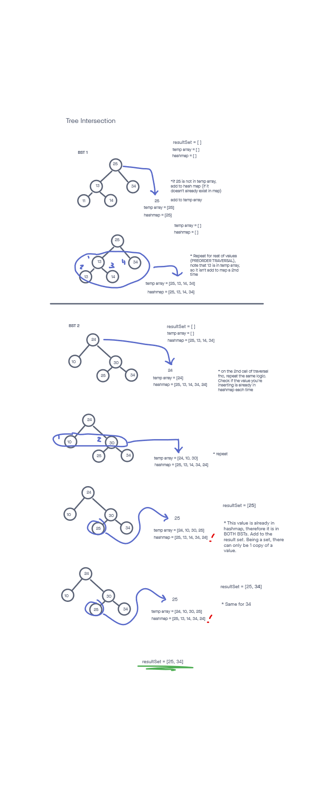

# Tree Intersection

## Challenge

Find common values in 2 binary trees. Use a hashmap in your implementation.

Write tests to prove the following functionality:

    Can successfully return a set of values found in both binary search trees
    Can handle 1 empty binary search tree
    Can handle 2 empty binary search trees
    Can handle 2 binary search trees with zero similar values
    Can handle 1 or both of the trees having just a single value
    Can handle duplicate values in the same tree. I.e., the algorithm won't think that such duplicates came from the other binary search tree

## Approach & Efficiency
<!-- What approach did you take? Why? What is the Big O space/time for this approach? -->
For this challenge created a method that iterated through a BST a single time. A method was created for this called on each BST. During this function, I used a hashmap to store each value. An additional temp array was used to make sure that duplicate values from the SAME tree weren't added to my hashmap. If my hashmap already had the to-be-added value, and it wasn't in my temp array, the value must be a duplicate between the trees and needed to be added to the result set.

I followed my created visual in order to more easily turn my idea into code.

The time complexity was O(n). I had to iterate through each tree once.

The space complexity was O(n) as well. I had 2 temp arrays, a hashmap, and a set created for this solution.

Pretty good complexity overall, but there's likely a simpler way to do this.

-----

## API
<!-- Description of each method publicly available to your Linked List -->
  treeIntersection(bst1, bst2):

  Arguments: 2 binary search trees
  Returns: a set of values
  This method iterates through 2 binary search trees and returns a set of values that are found in both

-----

### Whiteboard Visual

### Link To Code

Implementation can be found [here](./tree-intersection.js)

Tests can be found [here](./tree-intersection.test.js)
