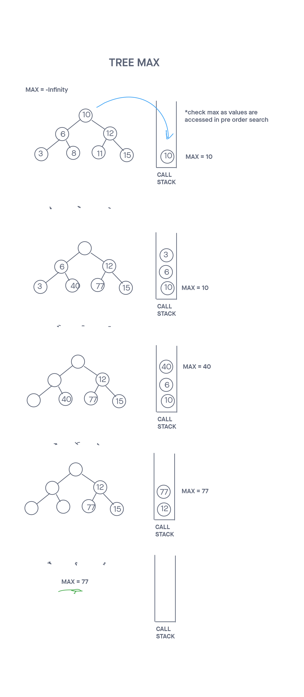

# Tree Max

## Binary Tree v2: Tree Max

## Challenge

Add a treeMax method to the existing binary tree class that iterates through the all the nodes in the tree and returns the maximum value

Tests were written to prove the following functionality:

    Can return the correct maximum value within the binary tree
    Can thrown an error if the tree is empty
    Can take an uneven binary tree (Some parent nodes don't have exactly 2 children) and return the correct maximum value

## Approach & Efficiency
<!-- What approach did you take? Why? What is the Big O space/time for this approach? -->
My approach for this one was to perform a preOrder traversal inside of  a helper method and simply update the max value as it changed. Any type of depth first search would have a similar efficiency since every node needed to by iterated over when finding the max value.

I followed my created visuals in order to more easily turn ideas into code.

The search for the max value took O(N) time. The space complexity was O(1) as only 2 variables were used and updated as the method executed.

-----

## API
<!-- Description of each method publicly available to your Linked List -->

Binary-tree

treeMax()

  Arguments: none
  Returns: The maximum value in the tree
  Traverses over the binary tree in pre-order, and returns the maximum value within the tree

getPreOrder()

  Arguments: none
  Returns: an array of values
  Traverses over the binary tree in pre-order, and returns an array of the values, ordered appropriately.

getInOrder()

  Arguments: none
  Returns: an array of values
  Traverses over the binary tree in in-order, and returns an array of the values, ordered appropriately.

getPostOrder()

  Arguments: none
  Returns: an array of values
  Traverses over the binary tree in post-order, and returns an array of the values, ordered appropriately.

-----

### Whiteboard Visual

### Link To Code

Code can be found 
