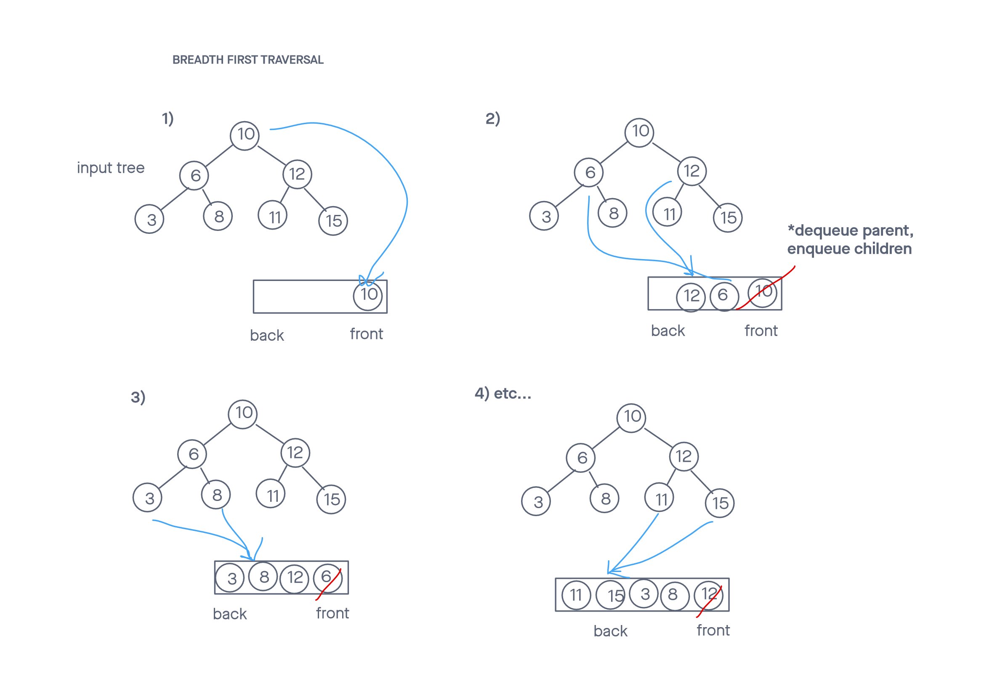

# Breadth first search

## Implements a breadth first traversal function

## Challenge

Create a breadthFirst function that when supplied a tree returns a list of elements in a tree, in breadth first order.

Tests were written to prove the following functionality:

    Can return a list of all values in the tree, with a breadth first ordering
    Can handle an empty tree as input
    Can work with non full binary trees (parent nodes have 1 child instead of 2)

## Approach & Efficiency
<!-- What approach did you take? Why? What is the Big O space/time for this approach? -->
Given the examples in the challenge, and no mentions otherwise, it is assumed here that the input tree will be a binary tree.

I chose to use a queue for this solution and to use an iterative approach. This allowed for a fairly simple set of steps where I would add children to the queue as soon as their parent was dequeued.

I followed my created visuals in order to more easily turn ideas into code.

The breadth first traversal took O(N) time. It also took O(N) space. The maximum amount of items in the queue would be about half of N, and there was an additional array used to store the resultant values.

-----

## API

breadthFirst(tree)

    Arguments: a binary tree

    Return: list of all values in the tree, in the order they were encountered

### Whiteboard Visual

### Link To Code

Code can be found 
