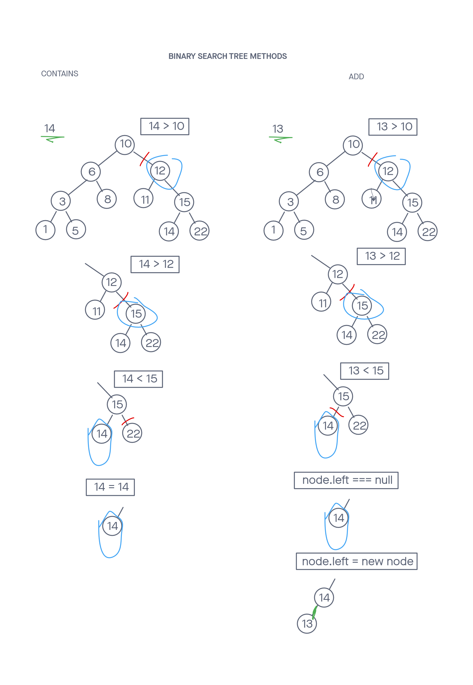

# Binary Tree Traversal and Binary Search Tree

## Implements one class that can traverse a binary tree and a subclass of it that can create a binary search tree

## Challenge

Create a base class called binary-tree which can traverse its nodes using any of the 3 depth first traversal methodologies. Then create a binary-search-tree class that extends from the former and allows the adding of nodes as well as allows for the checking of values within the tree.

Tests were written to prove the following functionality:

    Can successfully instantiate an empty tree
    Can successfully instantiate a tree with a single root node
    Can successfully add a left child and right child to a single root node
    Can successfully return a collection from a preorder traversal
    Can successfully return a collection from an inorder traversal
    Can successfully return a collection from a postorder traversal
    Can successfully add elements to a binary search tree in the correct spot
    Can successfully check if a given element is in the binary search tree

## Approach & Efficiency
<!-- What approach did you take? Why? What is the Big O space/time for this approach? -->
I chose a recursive solution. For each traversal method I had to find which of the 3 nodes (root, left, or right) would be used, and which 2 would be passed into recursive calls while keeping in mind the order of these 3 actions. A helper method was used to allow each value to be stored as the recursive calls ocurred.

I followed my created visuals in order to more easily turn ideas into code. This was especially important for coming up with the binary search tree methods.

The 3 traversals took O(N) time. I originally thought the add and contains methods took  O(log n) time, but it turns out they are a very similar O(H) time, H being the height of the tree.

-----

## API
<!-- Description of each method publicly available to your Linked List -->

Binary-tree

getPreOrder()

  Arguments: none
  Returns: an array of values
  Traverses over the binary tree in pre-order,and returns an array of the values, ordered appropriately.

getInOrder()

  Arguments: none
  Returns: an array of values
  Traverses over the binary tree in in-order, and returns an array of the values, ordered appropriately.

getPostOrder()

  Arguments: none
  Returns: an array of values
  Traverses over the binary tree in post-order,and returns an array of the values, ordered appropriately.

Binary-search-tree, extends Binary-tree

add(val):

  Arguments: a value to add
  Returns: nothing
  Adds a new node with that value in the correct location in the binary search tree.

contains(val):

  Argument: a value
  Returns: boolean
  checks to see whether or not the value is in the tree at least once.

-----

### Whiteboard Visual

### Link To Code

Code can be found  and [here (BST)](./binary-search-tree.js)
